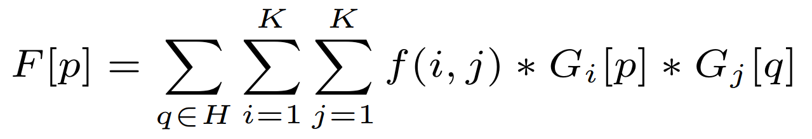

# Gather3d Evo - Python
### The following project allows users to compute 2, or 3 dimensional problems from the field of game theory. It is an implementation of work present in paper "". Please cite our work using a following formula "".

### The following repository contains both spatial and mixed games, that can be updated in multiple ways. All configuration is done via a YAML file. The implementation of all program elements allow simple adjustments and modifications of all provided functions.


#### 1. [Software Installation and configuration](#installation)
#### 1.1 [Installation](#installation)
#### 1.2 [First run](#First-run)
#### 2. [Algorithm overview](#Algorithm-overview)
#### 2.1 [The initial matrix](#The-initial-matrix)

#### 3. [Implemented Problems](#Implemented-problems)
#### 3.1 [Hawk Dove](#Hawk-Dove-problem)
#### 3.2 [Hawk Dove with resource function](#Dynamic-Hawk-Dove-problem)
#### 3.3 [Avoidance of apoptosis](#Apoptosis-problem)


#### 4. [Mortality](#Mortality)
#### 4.1 [Asynch](#Asynch)
#### 4.2 [Semi Synch](#Semi-Synch)
#### 4.3 [Synch](#Synch)

#### 5. [Neighbourhood](#Neighbourhood)
#### 5.1 [Von Neumann](#Von-Neumann)
#### 5.2 [Moore](#Moore)

#### 6. [Reproduction](#Reproduction)
#### 6.1 [Deterministic](#Deterministic)
#### 6.2 [Probabilistic](#Probabilistic)
#### 6.3 [Weighted](#Weighted)

#### 7. [Resource Function](#Resource-Function)
#### 7.1 [Single Step resource function](#Single-Step-resource-function)
#### 7.2 [Linear resource function](#Linear-resource-function)
#### 7.3 [Quadratic resource function](#Quadratic-resource-function)
#### 7.4 [Reciprocal resource function](#Reciprocal-resource-function)
#### 7.5 [Cosinus resource function](#Cosinus-resource-function)

#### 8. [Implemented parallelism](#Implemented-parallelism)

---

---

# Installation
### Our application was developed using python 3.11.3, however it shall run smoothly with other modern python versions.

### For python 3.11.3
```console
pip install requiremens.txt
```

### In case of conflicts try a minimal version
```console
pip install requiremens_minimal.txt
```

---

---

# First run
### To run an algorithm use a following command
```console
python main.py --yaml-path "<PATH TO YOUR YAML FILE>"
```
#### If a --yaml-path argument is not used a default yaml file is being loaded.
#### The results of analysis are saved in runs folder.

### To visualise the results of computations, use a following command: 
```console
python visualise.py 
```

---

---

## Algorithm overview
The evolutionary game takes place in so-called game array. Our software allows users to solve 2 and 3 dimensional problems, with an unlimited number of phenotypes (decisions). 
In each iteration a chosen mortality method selects N cell to be replaced/updated. Selected cells are being replaced using a reproduction method. 
It can be said that a cell is updated based on its neighbours and their fitness function.
The fitness for each cell is determined, by the chosen game theory problem. The fitness is calculated as the cell's phenotype against each neighbour's phenotype. 



* f - problem matrix
* f(i,j) - the value of problem matrix - player strategy i against enemy strategy j
* $G_i$ - Game array containing the allocations of phenotype i
* $G_i$[p] - The value of phenotype i in the player cell p
* $G_i$[q] - The value of phenotype i in the enemy cell q
* H - Set of neighbour's indices
* K - Num. Phenotypes.


### The matrix 
2 Dimensional game requires 3-dimensional matrix and 3-dimensional game requires 4 dimensional matrix. Additional dimension stores information about phenotype allocation in a given cell.

#### Example:
The game matrix of a 2-d problem with 3 phenotypes and population length equal to 10 is a matrix of size 10X10X3.

The phenotype allocation values are in range <0; 1> and their sum must be equal to 1 for each cell.

## The initial matrix
The matrix to be initiated requires an information about the number of dimensions and about the length of population. 
Additionally, it is required to determine the name of the problem (number and names of phenotypes is stored inside the problem class).

#### yaml command
```yaml
# Example set of parameters
population_length: 10

# number of dimensions can be equal to 2 or 3 
num_dim: 2

# problem name shall be the same as the name of class, 
# that describes a given problem
problem_name: HawkDoveProblem
```
If you would like to control the distribution of initial phenotypes the following parameter can be added.
#### yaml command
```yaml
# Example set of parameters

# It is important, that the names of phenotypes 
# match the names declared in the problem class.
initial_probability:
  Hawk: 0.43
  Dove: 0.57
```

I you do not want to randomize the initial game matrix, you can load one by using the parameter shown below. The process of correct creation of initial game matrix is shown in attached jupiter notebook "create_game_matrix.ipynb". 

#### yaml command
```yaml
# Put path to initial matrix. If you want to generate matrix on random put None.
initial_matrix: <Put tour path here>
```

---

---

# Implemented problems
### Hawk Dove problem
Hawk-dove is a state-of-the-art problem from the game theory domain. This problem assumes two phenotypes (decisions), between which players can choose. The fitness matrix is defined by 2 parameters - **V** (value of contest) and **C** (cost of escalated fight). 

$\begin{matrix}  & enemy \ Hawk & enemy \ Dove \\ player \ Hawk & (V-C)/2 & V \\ player \ Dove & 0 & V/2 \end{matrix}$

#### yaml command
```yaml
problem_name: HawkDoveProblem
```
#### yaml command
```yaml
# Example set of parameters
problem_params:
  V_param: 9
  C_param: 6
```

#### yaml command
```yaml
# Optional
# Example set of initial probabilities
initial_probability:
  Hawk: 0.29
  Dove: 0.71
```


### Dynamic Hawk Dove problem
Dynamic Hawk Dove problem is a modification of a well Hawk Dove problem. Apart from **V** and **C** parameters, the dynamic version introduces the **r** (resource function value) parameter. The resource function for this problem must be additionally declared. Parameter **r** might depend on time (number of epochs), amount of selected phenotype in the whole matrix, or amount of a phenotype in a neighbourhood.

$\begin{matrix}  & enemy \ Hawk & enemy \ Dove \\ player \ Hawk & (V-C)/2 & V \\ player \ Dove & r * V * 0.25 & V*0.5*(r+1) \end{matrix}$

#### yaml command
```yaml
problem_name: HawkDoveDynamicProblem
```
#### yaml command
```yaml
# Example set of parameters
problem_params:
  V_param: 9
  C_param: 6

```

#### yaml command
```yaml
# Optional
# Example set of initial probabilities
initial_probability:
  Hawk: 0.29
  Dove: 0.71
```

### Apoptosis problem
$\begin{matrix}  
        & enemy \ K & enemy \ M & enemy \ N \\ 
player \ K & 1 - a + b & 1 - a & 1-a \\ 
player \ M & 1+b+c & 1+c & 1+c \\  
player \ N & 1+b & 1 & 1
\end{matrix}$

#### yaml command
```yaml
problem_name: ApoptosisProblem
```
#### yaml command
```yaml
# Example set of parameters
problem_params:
  a_param: 0.2
  b_param: 0.3
  c_param: 0
```

---

---

# Mortality
### Asynch
#### Select one random cell for reproduction in an epoch.

#### yaml command
```yaml
mortality_strategy: ASynch
```


### Semi Synch
#### Each cell each cell has some probability of being selected, given probability by an additional parameter 'mortality_rate'.  It is important to note, that random number of cells is selected in each epoch, however in most cases it is close to the N% of all cells.
#### yaml command
```yaml
mortality_strategy: SemiSynch
```

### Synch
#### All cells are selected for the reproduction in each epoch.
#### yaml command
```yaml
mortality_strategy: Synch
```

---

---

## Neighbourhood
#### The cells are updated based on their neighbor's fitness functions. This is why the proper choice of a neighbourhood is crucial for solving spatial games. 

### Von Neumann
#### Only cells that are connected with a full edge/face are selected.


```yaml
neighbourhood_type: VonNeumann
```

### MOORE
#### All surrounding cells are selected.


```yaml
neighbourhood_type: Moore
```

---

---

## Reproduction
### Deterministic
### Probabilistic
### Weighted


## Resource Function
The parameter **r**, which might be used in dynamic problems to adjust the values of game matrix, is a result of function **R(x)**, where x can be a current epoch value, amount of a selected phenotype in the neighbourhood, or amount of a selected phenotype in the whole game matrix.
The resource function operates in 3 modes:
* local
* global
* time

### Single Step resource function
### Step resource function
### Linear resource function
### Quadratic resource function
### Reciprocal resource function

### Cosinus resource function

---

---

# Implemented parallelism


